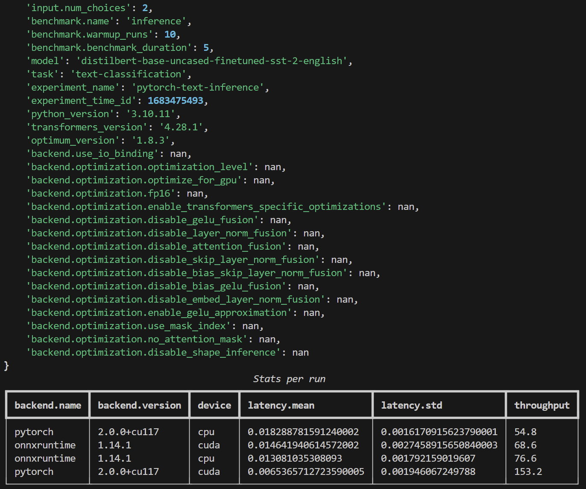

# inference-benchmark
A repository for benchmarking optimum's inference and training optimizations on different supported backends.
The experiment management and tracking is handled by [hydra](https://hydra.cc/) and based on [tune](https://github.com/huggingface/tune).

## Quickstart
Start by installing the required dependencies:

```bash
python -m pip install -r requirements.txt
```

Then, run one of the default benchmarks in `configs`.
For example, to run the `pytorch_text_inference` (default) benchmark:

```bash
python main.py --config-name pytorch_text_inference
```

Who's behavior is determined by `configs/pytorch_text_inference.yaml`.

## Command-line configuration overrides
It's easy to override the default behavior of your benchmark from the command line.

```
python main.py experiment_name=my-cuda-experiment backend=pytorch device=cuda
```

Results (`stats.json` and `details.csv`) will be stored in `runs/{experiment_name}/{experiment_datetime_id}`, along with the program logs `main.log`, the configuration that's been used `.hydra/config.yaml`.

## Multirun configuration sweeps
You can easily run configuration sweeps using the `-m` or `--multirun` option. By default, configurations will be executed serially but other kinds of executions are supported with hydra's launcher plugins : `hydra/launcher=submitit`, `hydra/launcher=slurm`, `hydra/launcher=joblib`, etc.

```
python main.py -m backend=pytorch,onnxruntime device=cpu,cuda
```

Also, for integer parameters like `batch_size`, one can specify a range of values to sweep over:

```
python main.py -m backend=pytorch,onnxruntime backend.device=cpu,cuda input.batch_size='range(1,10,step=2)'
```

Other features like intervals and log scale ranges of values are also supported through sweeper plugins: `hydra/sweeper=log`, `hydra/sweeper=bayesian`, `hydra/sweeper=optuna`, etc.

## Aggregating experiment results
To aggregate the results of an experiment (run(s) or sweep(s)), you can use the `aggregator.py` script:

```
python aggregator.py --folder {folder_path}
```

This will generate `report.csv` and `environment` files in the specified directory. The `report.csv` file contains the aggregated sweep results of all the runs in the directory (only tracking sweep parameters). The `environment` file contains all parameters that didn't change during the sweep.

The console output will be something like this:


## TODO
- [x] Add support for other model inputs (vision, audio, etc.)
- [x] Add support for omptimum optimizations (graph optimization, quantization, etc.)
- [x] Gather report data from an experiment directory.
- [ ] Add support for sparse inputs (zeros in the attention mask)
- [ ] Add support for more metrics (memory usage, node execution time, etc.)

- [ ] Dana benchmark regression and comparison system with dashboard
- [ ] ...