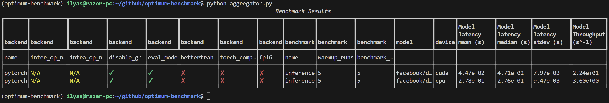

# inference-benchmark

A repository for benchmarking optimum's inference and training optimizations on different supported backends.
The experiment management and tracking is handled by [hydra](https://hydra.cc/) and based on [tune](https://github.com/huggingface/tune).

## Quickstart

Start by installing the required dependencies:

```bash
python -m pip install -r requirements.txt
```

Then, run one of the default benchmarks in `configs`.
For example, to run the default `whisper` benchmark:

```bash
python main.py --config-name whisper
```

Who's behavior is determined by `configs/whisper.yaml`.

## Command-line configuration overrides

It's easy to override the default behavior of your benchmark from the command line.

```
python main.py --config-name whisper experiment_name=my-cuda-whisper device=cuda
```

Results (`inference_results.csv` or `profiling_results.csv`) will be stored in `runs/{experiment_name}/{experiment_id}`, along with the program logs `main.log` and the configuration that's been used `config.yaml`.

## Multirun configuration sweeps

You can easily run configuration sweeps using the `-m` or `--multirun` option. By default, configurations will be executed serially but other kinds of executions are supported with hydra's launcher plugins : `hydra/launcher=submitit`, `hydra/launcher=rays`, etc.

```
python main.py -m --config-name backend=pytorch,onnxruntime device=cpu,cuda
```

Also, for integer parameters like `batch_size`, one can specify a range of values to sweep over:

```bash
python main.py --config-name bert -m backend=pytorch,onnxruntime device=cpu,cuda input.batch_size='range(1,10,step=2)'
```

Other features like intervals and log scale ranges of values are also supported through sweeper plugins: `hydra/sweeper=optuna`, `hydra/sweeper=nevergrad`, etc.

## Aggregating experiment results

To aggregate the results of an experiment (run(s) or sweep(s)), you can use the `aggregator.py` script:

```bash
python aggregator.py --folder {folder_path}
```

This will generate `report.csv` in the specified directory which contains the aggregated results of all the runs/sweeps in the directory.

The console output will be something like this (using `rich`)



## Configurations structure

You can create custom configuration files following the examples in `configs` directory.
The easiest way to do so is by using `hydra`'s [composition](https://hydra.cc/docs/0.11/tutorial/composition/).

The base configuration is `configs/base_experiment.yaml`.
For example, to create a configuration that uses a `wav2vec2` model and `onnxruntime` backend, it's as easy as:

```yaml
defaults:
  - base_experiment
  - _self_
  - override backend: onnxruntime

# experiment name can be set or inferred from pramaeters
experiment_name: onnxruntime-wav2vec2
model: bookbot/distil-wav2vec2-adult-child-cls-37m
```

This is especially useful for creating sweeps, where the cli commands become too long. An example is provided in `configs/optuna.yaml` for an exhaustive sweep over all possible cominations of `onnxruntime`'s graph optimizations (leve, layer fusions, etc.) and quantizations (operator, weights, etc.). The command to run it is:

```bash
python main.py -m --config-name optuna
```

But in this example in particule we don't use the basic sweeper (that's used for testing all combinations) but rather a custom one that leverages [optuna](https://optuna.org/) to find the best combination in `n_trials` run, reducing the latency with bayesian optimization (isn't that cool?).

At the end of it you get an additional `optimization_results.yaml` file that contains the best combination of parameters found by optuna.

## TODO

- [x] Add support for any kind of input (text, audio, image, etc.)
- [x] Add support for onnxruntime backend
- [x] Add support for omptimum graph optimizations
- [x] Add support for optimum quantization
- [x] Add experiments aggregator to report on data from different runs/sweeps.
- [x] Add support for sweepers latency optimization (optuna, nevergrad, etc.)
- [x] Add support for profiling nodes/kernels execution time.
- [x] add Dana client to send results to the dashboard [(WIP)](https://github.com/IlyasMoutawwakil/optimum-dana)

- [ ] Add Pydantic for schema validation.
- [ ] Add support for quantization calibration.
- [ ] Add support for sparse inputs (zeros in the attention mask)
- [ ] Add support for more metrics (memory usage, node execution time, etc.)
- [ ] ...
