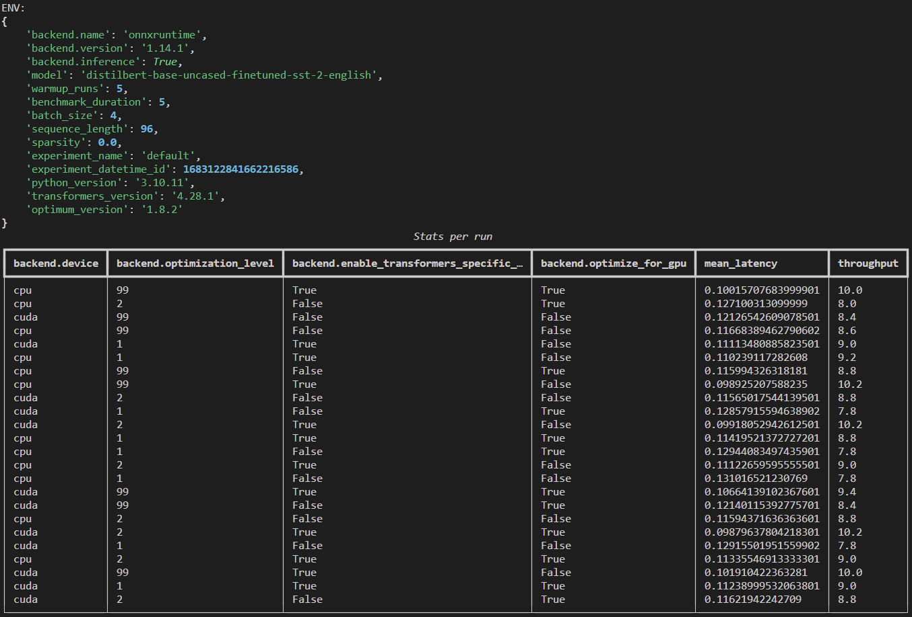

# inference-benchmark
A repository for benchmarking optimum's inference optimizations on different supported backends.
The configuration management is handled by [hydra](https://hydra.cc/) and based on [tune](https://github.com/huggingface/tune).

## Quickstart
Start by installing the required dependencies:

```
python -m pip install -r requirements.txt
```

Then, run the default benchmark:

```
python main.py
```

The default behavior is determined by `configs/benchmark.yaml`.

## Command-line configuration overrides
It's easy to override the default behavior of your benchmark from the command line.

```
python main.py experiment_name=my-new-gpu-experiment model=bert-base-uncased backend=pytorch backend.device=cuda
```

Results (`stats.json` and `details.csv`) will be stored in `outputs/{experiment_name}/{experiment_datetime_id}`, along with the program logs `main.log`, the configuration that's been used `.hydra/config.yaml` and overriden parameters `.hydra/overrides.yaml`.

## Multirun configuration sweeps
You can easily run configuration sweeps using the `-m` or `--multirun` option. By default, configurations will be executed serially but other kinds of executions will are supported with hydra's launcher plugins : `hydra/launcher=submitit`, `hydra/launcher=slurm`, `hydra/launcher=joblib`, etc.

```
python main.py -m backend=pytorch,onnxruntime backend.device=cpu,cuda
```

Also, for integer parameters like `batch_size`, one can specify a range of values to sweep over:

```
python main.py -m backend=pytorch,onnxruntime backend.device=cpu,cuda batch_size='range(1, 10, step=2)'
```

And other features like log scaling a range of values are also supported through sweeper plugins: `hydra/sweeper=log`, `hydra/sweeper=bayesian`, `hydra/sweeper=optuna`, etc.

## Visualizing results (WIP)
To synthetize the results of a sweep or all sweeps, you can use the `report.py` script:

```
python report.py --folder sweeps/default
```

You can also specify a directory containing multiple sweeps:

```
python report.py --folder sweeps
```

The report output will be something like this:


## Notes

For now, sweeps can only run over one backend because backends don't share the same configuration parameters.

## TODO
- [x] Add support for sparse inputs (zeros in the attention mask)
- [-] Add support for omptimum optimizations (graph optimization, quantization, etc.)
- [ ] Add support for other model inputs (pixels, decoder_inputs, etc.)
- [ ] Add support for more metrics (memory usage, node execution time, etc.)
- [x] Gather report data from an experiment directory.
- [x] Visualize the report data.
- [ ] ...