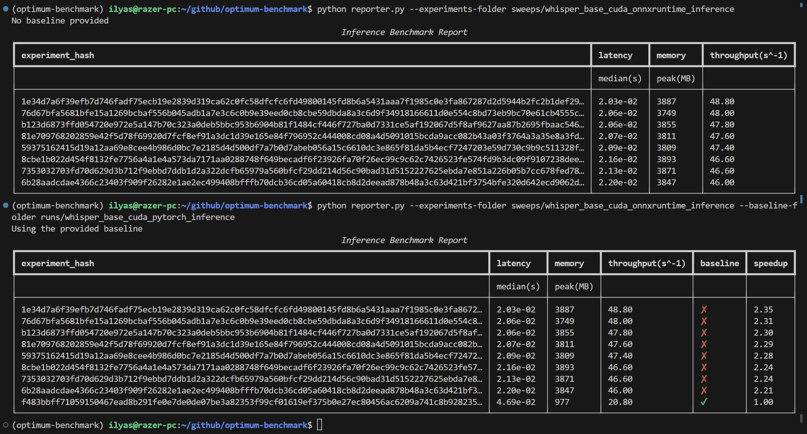

# AutoBenchmark

## The idea

A repository aiming to create a universal benchmarking utility for any model on HF hub while supporting optimum's inference and training optimizations on different backends and hardware.
The experiment management and tracking is handled by [hydra](https://hydra.cc/) and inspired from [tune](https://github.com/huggingface/tune).

## Motivation

- Many users would want to know how their models perform (latency/throughput) before deploying them to production (found examples in slack).
- Many hardware vendors would want to know how their hardware performs on different models and how it compares to others.
- Optimum offers a lot of optimizations that can be applied to models to improve their performance, but it's hard to know which ones to use and how much they improve the performance before trying them out.
- Benchmarks depend heavily on many factors, many will post a "+500% speedup compared to baseline" without giving a trace of what optimizations were used in the baseline (disabling gradients, fp16, etc.).

## Quickstart

Start by installing the required dependencies:

```bash
python -m pip install -r requirements.txt
```

Then copy `examples/bert.yaml` to `configs/bert.yaml` and run the benchmark with:

```bash
python main.py --config-name bert
```

This will run the benchmark on the default backend (`pytorch`) and device (`cuda`) and store the results in `runs/bert_baseline`.

The result files are `inference_results.csv` and `profiling_results.csv` in case profiling is enabled.
There's also the program's logs `main.log` and the configuration that's been used `hydra_config.yaml`

The directory for storing these results can be changed using the `hydra.run.dir` (and/or `hydra.sweep.dir`) in the command line or in the config file (see [`hydra_base.yaml`](configs/hydra_base.yaml) for example).

## Command-line configuration overrides

It's easy to override the default behavior of a benchmark from the command line.

```
python main.py --config-name bert backend=onnxruntime device=cpu
```

## Multirun configuration sweeps

You can easily run configuration sweeps using the `-m` or `--multirun` option. By default, configurations will be executed serially but other kinds of executions are supported with hydra's launcher plugins : `hydra/launcher=submitit`, `hydra/launcher=rays`, etc.

```bash
python main.py --config-name bert -m backend=pytorch,onnxruntime device=cpu,cuda
```

Also, for integer parameters like `batch_size`, one can specify a range of values to sweep over:

```bash
python main.py --config-name bert -m backend=pytorch,onnxruntime device=cpu,cuda benchmark.input.batch_size='range(1,10,step=2)'
```

Other features like intervals and log scaled ranges of values are also supported through sweeper plugins: `hydra/sweeper=optuna`, `hydra/sweeper=nevergrad`, etc.

## Reporting benchamrk results

To aggregate the results of a benchmark (run(s) or sweep(s)), you can use the `reporter.py` script:

```bash
python reporter.py --baseline {baseline_folder} --experiments {experiments_folder_1} {experiments_folder_2} ...
```

This will generate `inference_report.csv` in the specified baseline directory which will contain the aggregated results of all the runs/sweeps with their corresponding configurations (one big dataframe for you).

The console outputs will be something like this:


## Configurations structure

You can create custom configuration files following the [examples here](examples).
The easiest way to do so is by using `hydra`'s [composition](https://hydra.cc/docs/0.11/tutorial/composition/) with the base configuration is [`configs/hydra_base.yaml`](configs/hydra_base.yaml).

For example, to create a configuration that uses a `wav2vec2` model and `onnxruntime` backend, it's as easy as:

```yaml
defaults:
  - hydra_base
  - _self_
  - override backend: onnxruntime

# experiment name can be set or inferred from pramaeters
model: bookbot/distil-wav2vec2-adult-child-cls-37m
device: cpu

experiment_name: onnxruntime_wav2vec2
```

This is especially useful for creating sweeps, where the cli commands become too long.

An example is provided in [`examples/whisper_auto_opt+qnt.yaml`](examples/whisper_auto_opt+qnt.yaml) for an exhaustive sweep over all possible cominations of `optimum`'s AutoOptimizations and AutoQuantizations on CPU.

The command to run it (once you've copied it to `configs/`) is:

```bash
python main.py --config-name whisper_auto_opt+qnt -m
```

## TODO

- [x] Add support for any kind of input (text, audio, image, etc.)
- [x] Add support for onnxruntime backend
- [x] Add support for omptimum graph optimizations
- [x] Add support for optimum quantization
- [x] Add experiments aggregator to report on data from different runs/sweeps.
- [x] Add support for sweepers latency optimization (optuna, nevergrad, etc.)
- [x] Add support for profiling nodes/kernels execution time.
- [x] Add support for more metrics (memory usage, node execution time, etc.)
- [ ] Find a way to seperate where experiments are stored from the configuration files (shouldn't be too long and should follow some kind of convention).
- [ ] Make a consistent reporting utility.
- [ ] Migrate configuration management to be handled solely in dataclasses (practical or not?)
- [ ] Add Pydantic for schema validation.
- [ ] Add support for static quantization + calibration.
- [ ] Add support for sparse inputs.
- [ ] ...
- [x] add Dana client to send results to the dashboard [(WIP)](https://github.com/IlyasMoutawwakil/optimum-dana)
