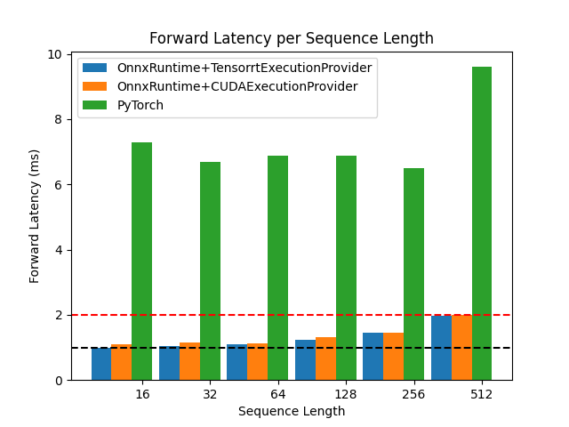
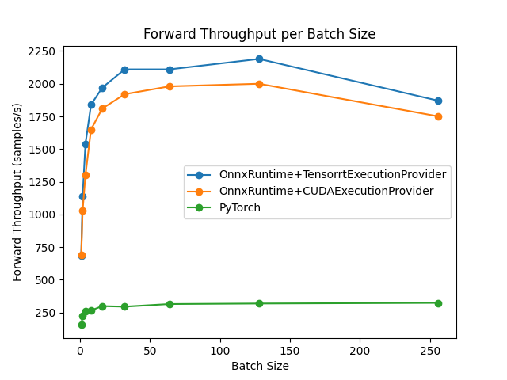

# Optimum-Benchmark x MTEB

A set of performance benchmarks using [`BAAI/bge-base-en-v1.5`](https://huggingface.co/BAAI/bge-base-en-v1.5), the number one embedding model on the [`Massive Text Embedding Benchmark (MTEB) Leaderboard`](https://huggingface.co/spaces/mteb/leaderboard).

Just run `script.sh` from this directory:

```bash
sh script.sh
```

This script will run sweeps over batch sizes and sequence lengths for each backend using the config files in `configs/`. The results of the sweeps will be saved in `experiments/`. Then run the reporting script `report.py`:

```bash
python report.py -e experiments/
```

Which will generate the plots and csv files in `artifact/`.

## Results

### Latency

For latency, we consider the case of a server processing requests one at a time (i.e. batch size of 1).
We achieve 1 to 2 milliseconds latency for the forward pass of the embedding model using either `CUDAExecutionProvider` with `O4` optimization level or `TensorrtExecutionProvider` with `fp16` precision. This can be seen as a 5x to 7x speedup over the baseline pytorch model.

<p align="center">
  
</p>

### Throughput

For throughput, we consider the case of a server processing requests of average length (i.e. sequence length of 256).
We achieve a throughput of +2000 samples per second for the forward pass of the embedding model at an optimal batch size of 128 using either `CUDAExecutionProvider` with `O4` optimization level or `TensorrtExecutionProvider` with `fp16` precision. This can be seen as a 7.5x increase over the baseline pytorch model.

<p align="center">
  
</p>

### Notes

Some other cases, such as processing big batches of short sequences, can demonstrate even higher speedups (~15x). We don't study them here.
