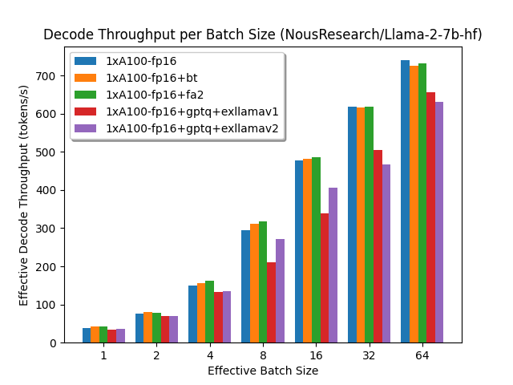
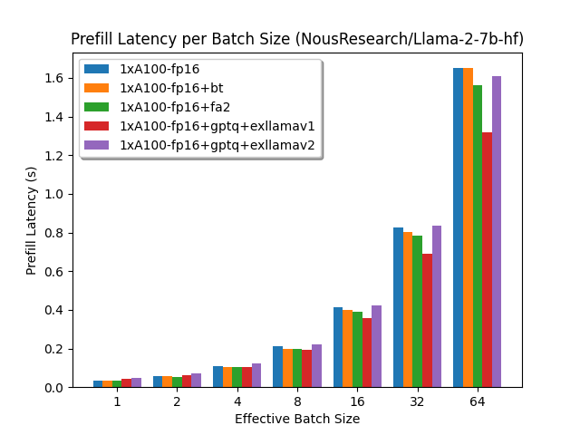
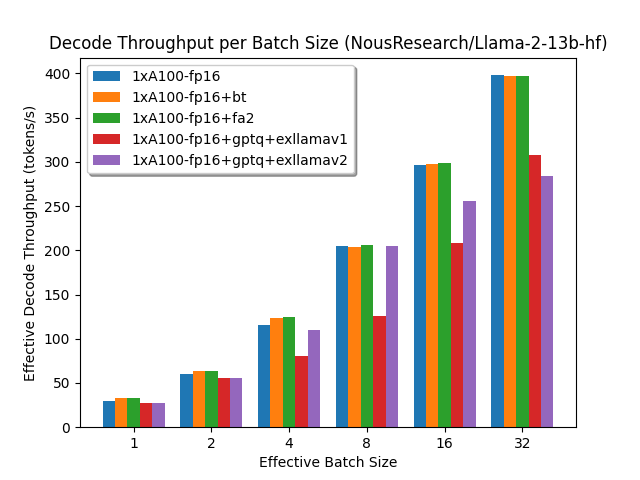
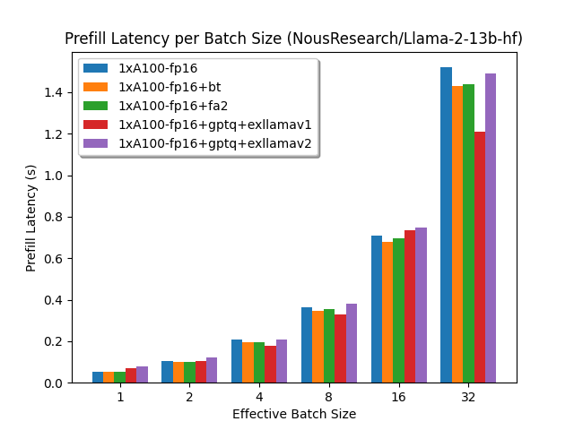
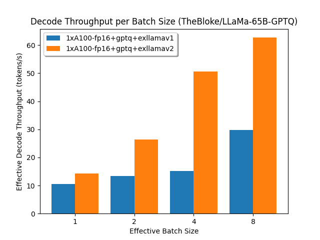
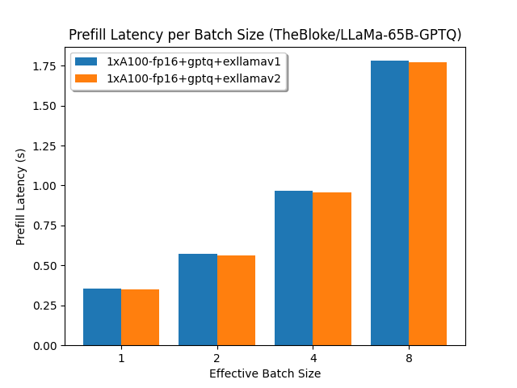

# Optimum-Benchmark x LLaMA

A set of benchmarks on Meta's LLaMA2's inference.

## Setup

You will need to install any necessary third-party libraries like `deepspeed` or `auto-gptq` depending on the hardware and benchmarks you want to run.

For example running FlashAttentionV2 on two devices with Tensor Parallelism (i.e. `fp16+fa2+tp=2`) will require: `deepspeed` and `flash-attn`

## Running

Then run the benchmarks from this directory with:

```bash
optimum-benchmark --config-dir configs/ --config-name fp16 --multirun
optimum-benchmark --config-dir configs/ --config-name fp16+fa2+tp=2 --multirun
[...]
```

This will create a folder called `experiments` with the results of the benchmarks with an inference `batch_size` ranging from 1 to 128 and an input `sequence_length` (prompt size) of 256.

## Reporting

To create a report for 7B models on A100-80GB, run:

```bash
python report.py -e experiments/hf-dgx-01/NousResearch/Llama-2-7b-hf/ experiments/hf-dgx-01/TheBloke/LLaMa-7B-GPTQ/ -r artifacts/Llama-7b/
python report.py -e experiments/hf-dgx-01/NousResearch/Llama-2-13b-hf/ experiments/hf-dgx-01/TheBloke/LLaMa-13B-GPTQ/ -r artifacts/Llama-13b/
python report.py -e experiments/hf-dgx-01/NousResearch/Llama-2-65b-hf/ experiments/hf-dgx-01/TheBloke/LLaMa-65B-GPTQ/ -r artifacts/Llama-65b/
```

Which will create some quick reporting artifacts like a `full_report.csv`, `short_report.csv`, and some interesting analysis plots.


## Results

### LLaMA-7B on A100-80GB

<p align="center">

</p>

<p align="center">

</p>

### LLaMA-13B on A100-80GB

<p align="center">

</p>

<p align="center">

</p>

### LLaMA-65B on A100-80GB

<p align="center">

</p>

<p align="center">

</p>