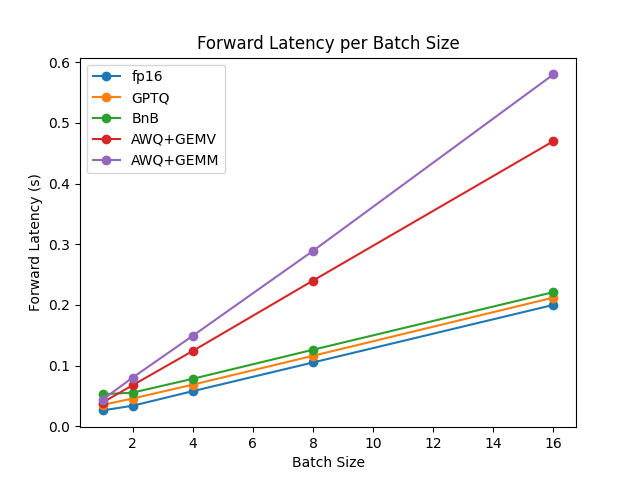
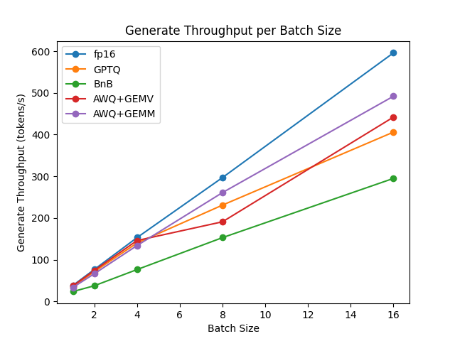
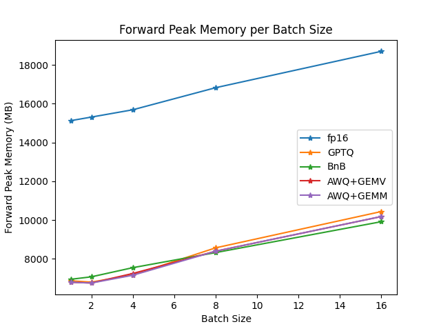
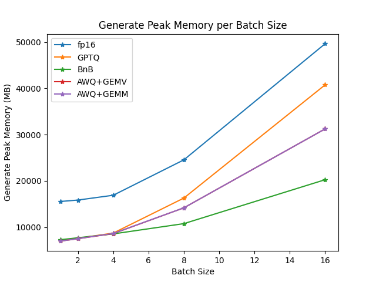
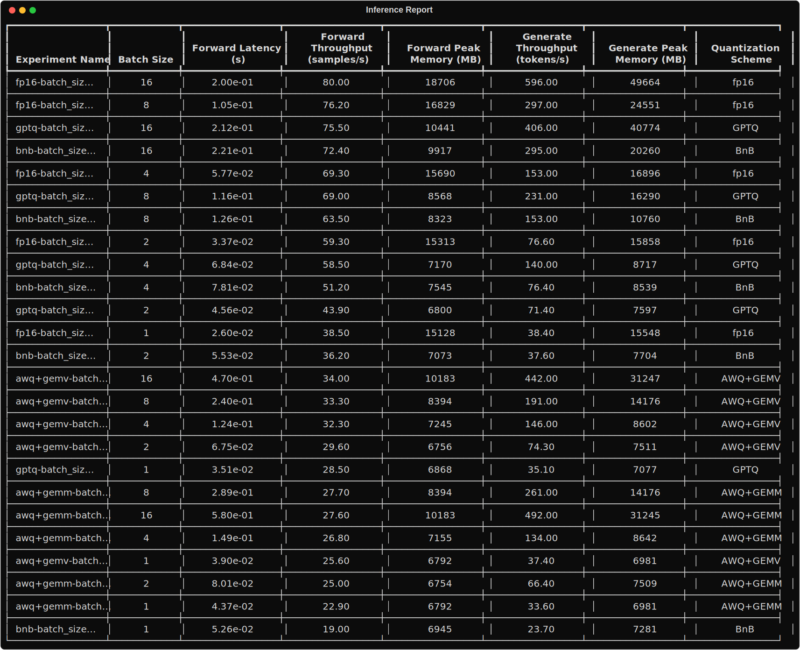

# Optimum-Benchmark x Vicuna x BnB & GPTQ & (AWQ+GEMM vs AWQ+GEMV)

A set of benchmarks on quantizing Vicuna.

## Setup

You will need to install these quantization packages:

```bash
pip install autoawq
pip install auto-gptq
pip install bitsandbytes
```

## Running

Then run these commands from this directory:

```bash
optimum-benchmark --config-dir configs/ --config-name _base_ --multirun
optimum-benchmark --config-dir configs/ --config-name bnb --multirun
optimum-benchmark --config-dir configs/ --config-name gptq --multirun
optimum-benchmark --config-dir configs/ --config-name awq+gemm --multirun
optimum-benchmark --config-dir configs/ --config-name awq+gemv --multirun
```

This will create a folder called `experiments` with the results of the benchmarks with an inference `batch_size` ranging from 1 to 16 and an input `sequence_length` (prompt size) of 128.

## Reporting

To create a report run:

```bash
python report.py -e experiments
```

Which will create some quick reporting artifacts like a `full_report.csv`, `short_report.csv`, some plots and a `rich_table.svg`.

## Results

### On A100-80GB

<p align="center">

</p>

<p align="center">

</p>

<p align="center">

</p>

<p align="center">

</p>

<p align="center">

</p>
