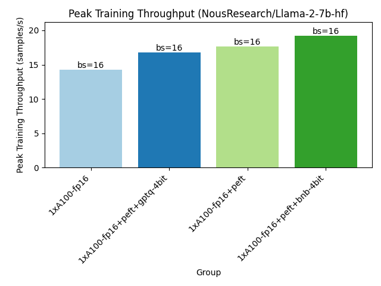
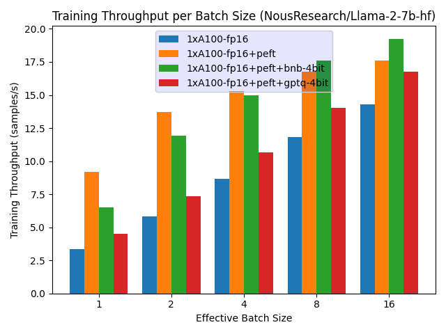
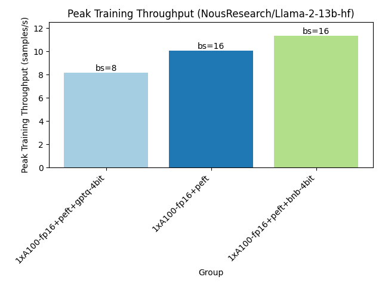
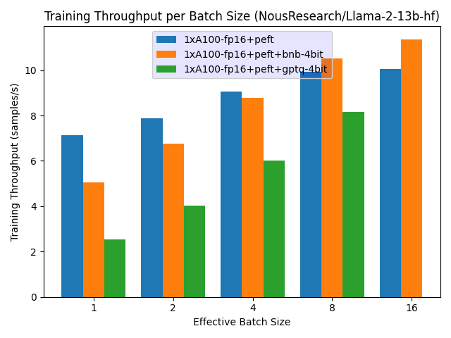

# Optimum-Benchmark x LLaMAs x PEFT

A set of benchmarks on Meta's LLaMA2's training.

## Setup

You will need to install any necessary third-party libraries like `deepspeed` or `auto-gptq` depending on the hardware and benchmarks you want to run.

For example running PEFT on two devices with Model Parallelism (i.e. `fp16+peft+dp=2+zero3`) will require: `peft` and `deepspeed`

## Running

Then run the benchmarks from this directory with:

```bash
optimum-benchmark --config-dir configs/ --config-name fp16 --multirun
optimum-benchmark --config-dir configs/ --config-name fp16+peft+dp=2+zero3 --multirun
[...]
```

This will create a folder called `experiments` with the results of the benchmarks with a training `batch_size` ranging from 1 to 128 and a `sequence_length` (sample size) of 256.

## Reporting

To create a report for 7B models on A100-80GB, run:

```bash
python report.py -e experiments/hf-dgx-01/NousResearch/Llama-2-7b-hf/ -r artifacts/Llama-2-7b-hf/
python report.py -e experiments/hf-dgx-01/NousResearch/Llama-2-13b-hf/  -r artifacts/Llama-2-13b-hf/
```

Which will create some quick reporting artifacts like a `full_report.csv`, `short_report.csv`, and some interesting analysis plots.

## Results

### LLaMA-7B on A100-80GB

<p align="center">

</p>

<p align="center">

</p>

### LLaMA-13B on A100-80GB

<p align="center">

</p>

<p align="center">

</p>
