# Optimum-Benchmark x Whisper

A set of benchmarks on OpenAI's Whisper model, using Optimum-Benchmark.

With Optimum-Benchmark, once you clone the repo and install it, run:

```bash
sh benchmark.sh ${device}
sh report.sh ${device}
```

Where `${device}` is either `cpu` or `cuda`.

## Metrics

Fo this benchmark I tried to compare `whisper-base` model's throughputs (forward and generate).

Forward throughput is measured in `samples/second` with the formula `number_processed_samples / total_time`.
Where `number_processed_samples = batch_size * number_forward_passes` is the number of samples processed by the model in `total_time`.

Generate throughput is measured in `tokens/second` with the formula `number_generated_tokens / total_time`.
Where `number_generated_tokens = batch_size * num_tokens * number_generate_passes` is the number of tokens generated by the model in `total_time`.

## Search Space

To be exhaustive, I benchmarked different auto optimization configurations supported by Optimum on GPU & CPU and auto quantization configrations on CPU only.

I also added `benchmark.batch_size=64,128 benchmark.new_tokens=10,100` to compare behavior across different batch sizes and number of generated tokens.

## GPU Results (NVIDIA A100)

### Batch Size = 64, New Tokens = 10

<div>
  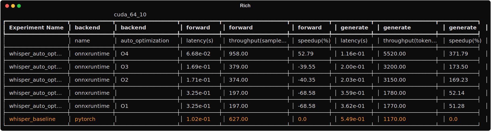
</div>
<div>
  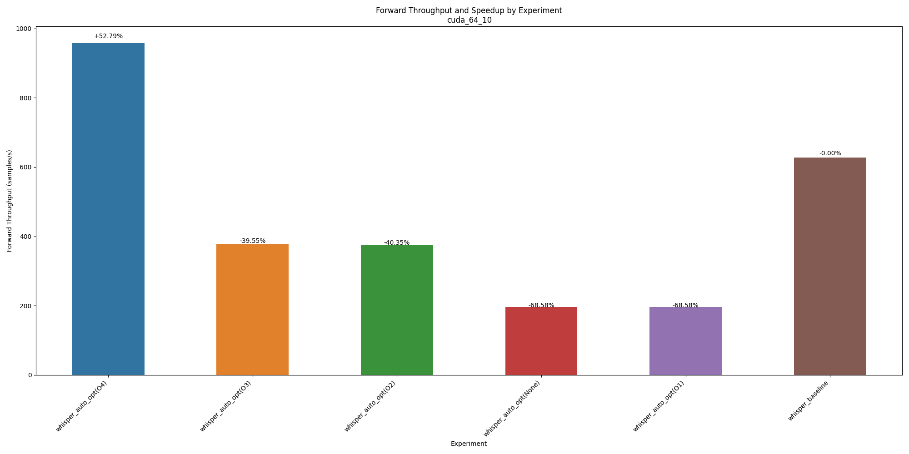
  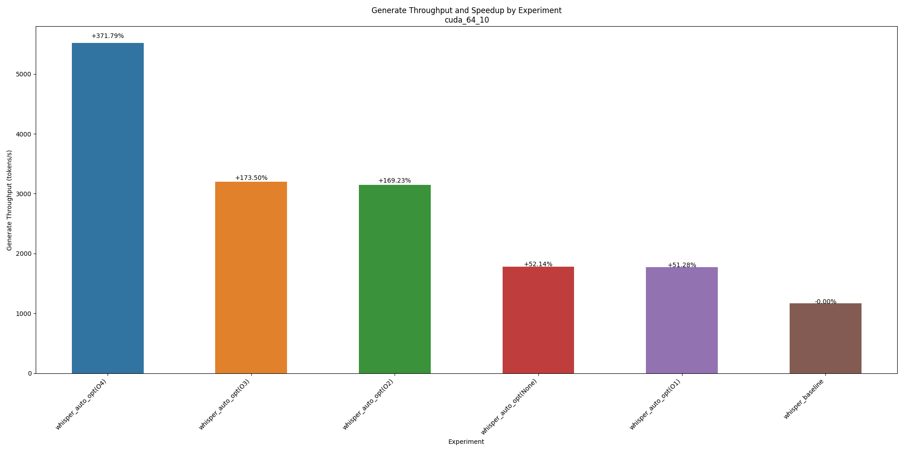
</div>

### Batch Size = 64, New Tokens = 100

<div>
  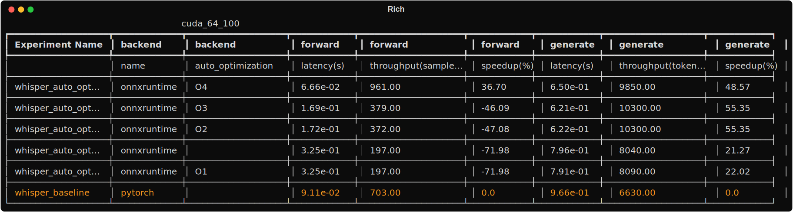
</div>
<div>
  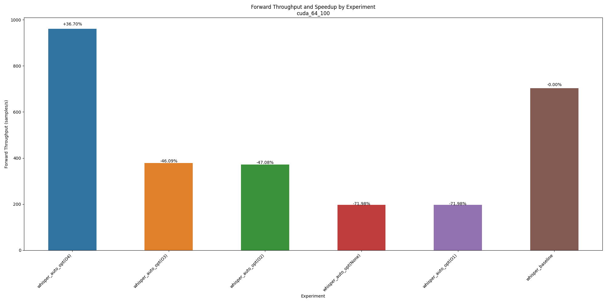
  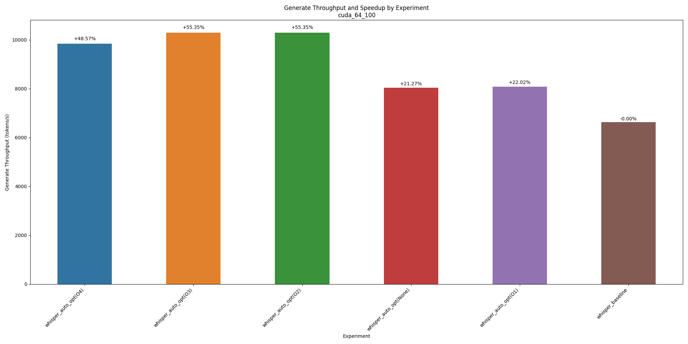
</div>

### Batch Size = 128, New Tokens = 10

<div>
  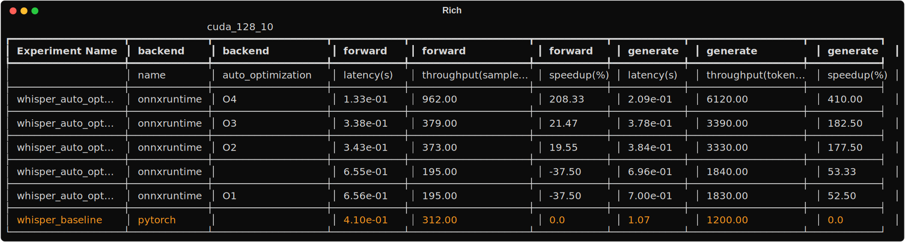
</div>

<div>
  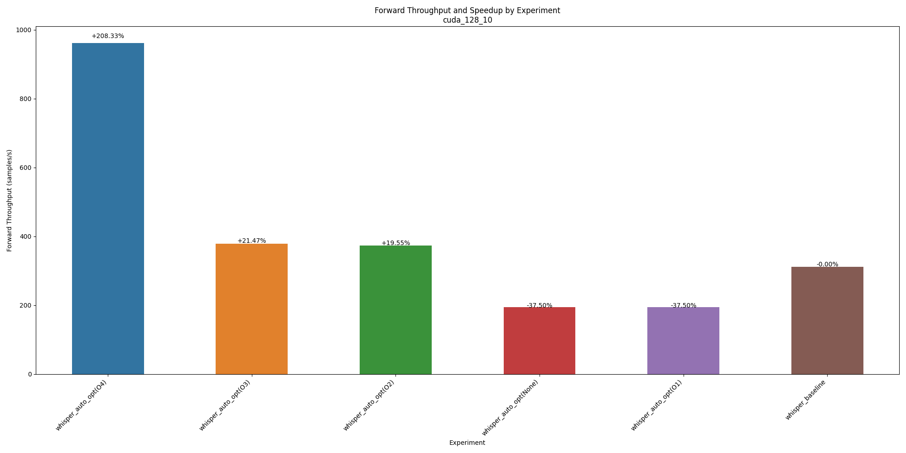
  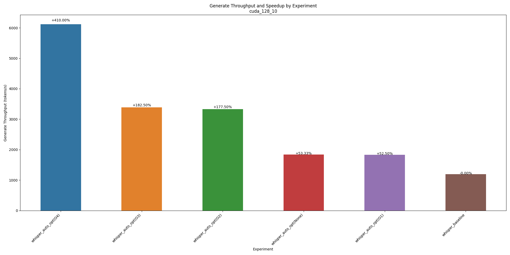
</div>

### Batch Size = 128, New Tokens = 100

<div>
  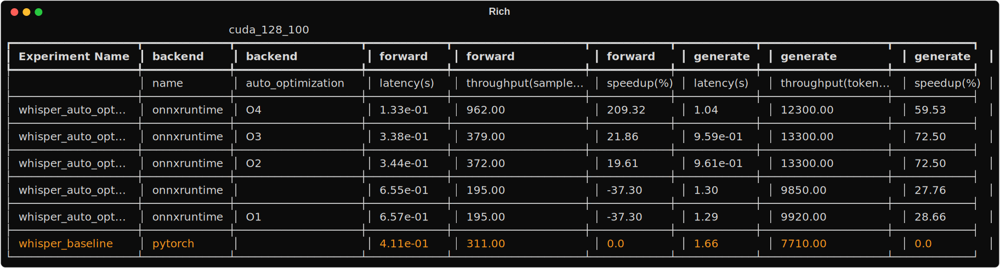
</div>

<div>
  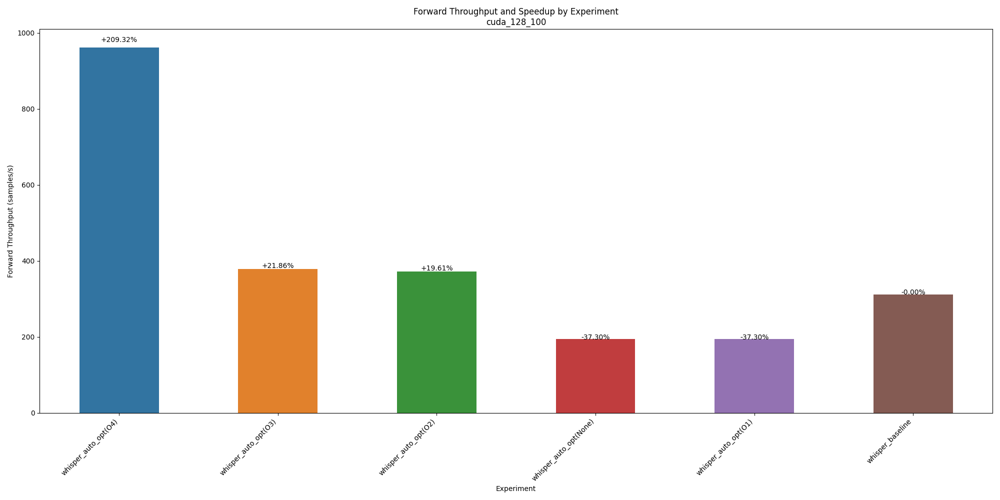
  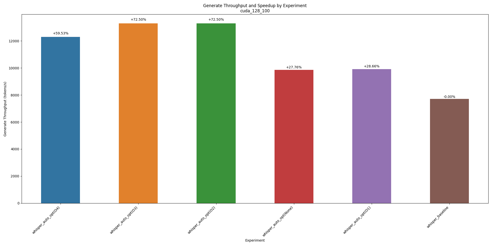
</div>
