# Optimum-Benchmark x Whisper

A set of benchmarks on OpenAI's Whisper model, using Optimum-Benchmark.

To isolate CPU and GPU performance, I used Colab's GPU (NVIDIA T4) and CPU (Intel(R) Xeon(R) CPU @ 2.20GHz) machines.

With Optimum-Benchmark, once you clone the repo and install depndancies, it's as easy as:

```bash
python main.py --config-name whisper_baseline -m device=${device}
python main.py --config-name whisper_auto_opt -m device=${device}
python main.py --config-name whisper_auto_qnt -m device=${device} # only for CPU
python main.py --config-name whisper_auto_opt+qnt -m device=${device} # only for CPU
```

Where `${device}` is either `cpu` or `cuda`.

## Metrics

Fo this benchmark I tried to compare `whisper-base` model's throughputs (forward and generate).

Forward throughput is measured in `iteration/second` with the formula `number_forward_passes / total_time`.
Where `number_forward_passes` is the total number of forward passes done by the model in `total_time`.

Generate throughput is measured in `tokens/second` with the formula `number_generated_tokens / total_time`.
Where `number_generated_tokens = batch_size * num_tokens * number_generate_passes` is the number of tokens generated by the model in `total_time`.

## Search Space

To be exhaustive, I benchmarked different auto optimization configurations supported by Optimum on GPU & CPU and auto quantization configrations on CPU only.

I also added `benchmark.batch_size=1,8 benchmark.new_tokens=10,100` to compare behavior across different batch sizes and number of generated tokens.

## GPU Results (NVIDIA T4)

### Batch Size = 1, New Tokens = 10

<div>
  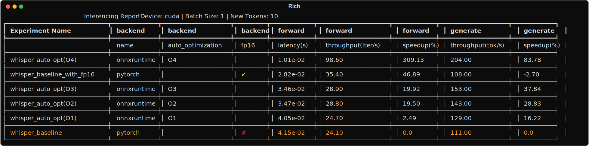
</div>
<div>
  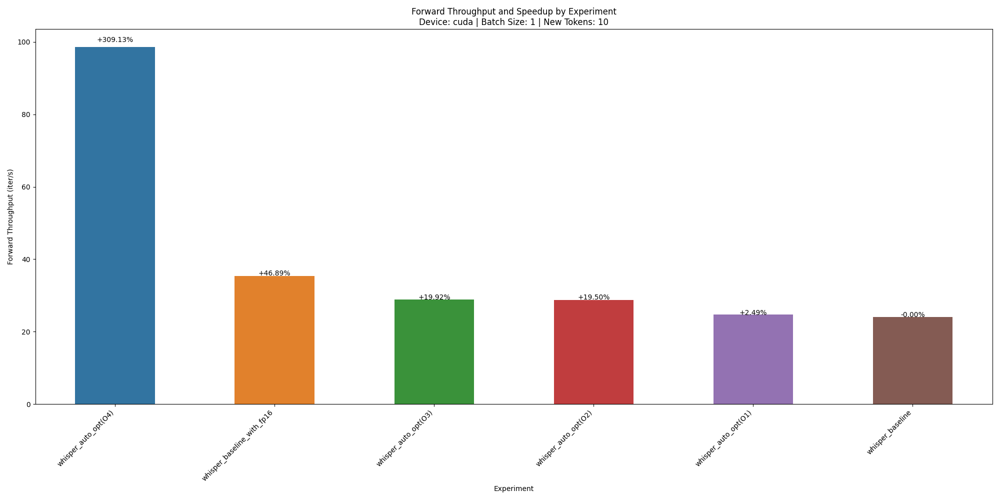
  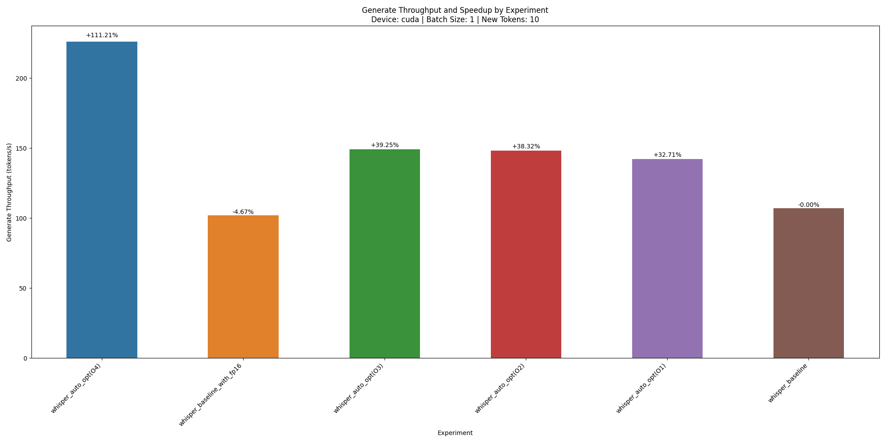
</div>

### Batch Size = 1, New Tokens = 100

<div>
  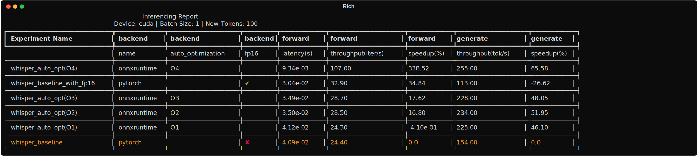
</div>
<div>
  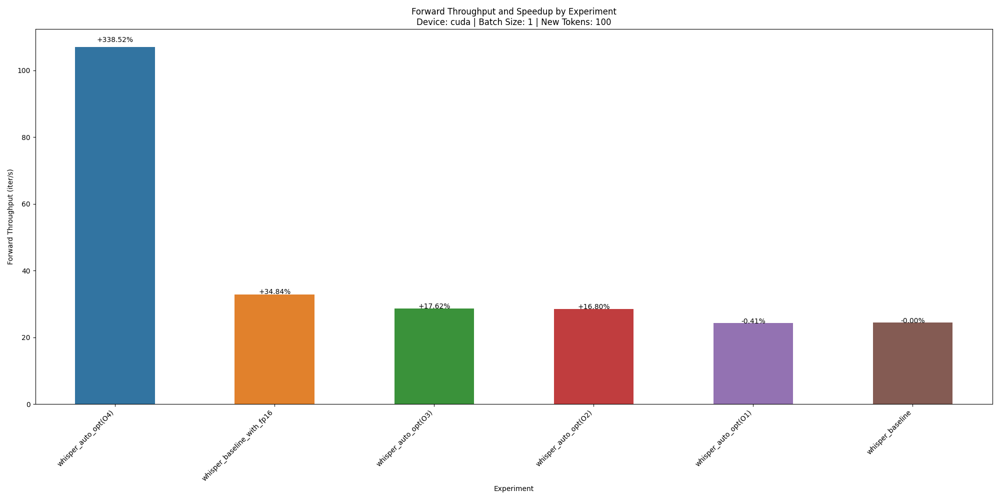
  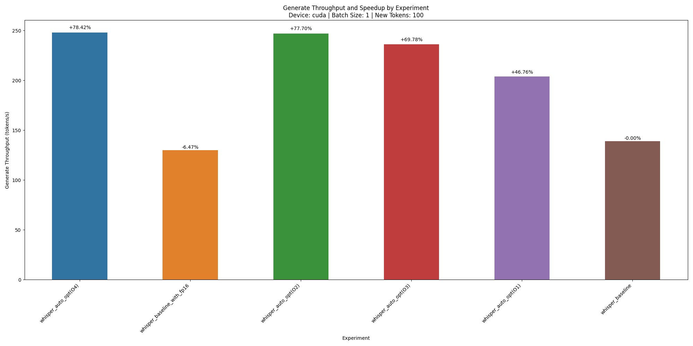
</div>

### Batch Size = 8, New Tokens = 10

<div>
  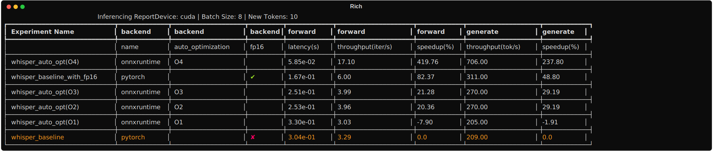
</div>

<div>
  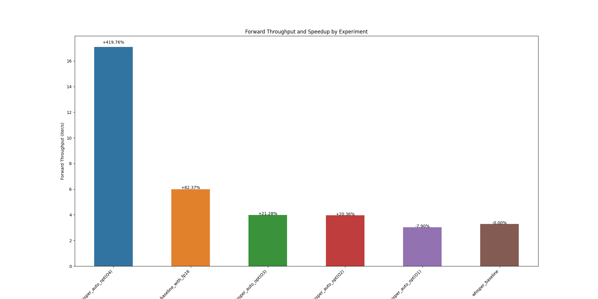
  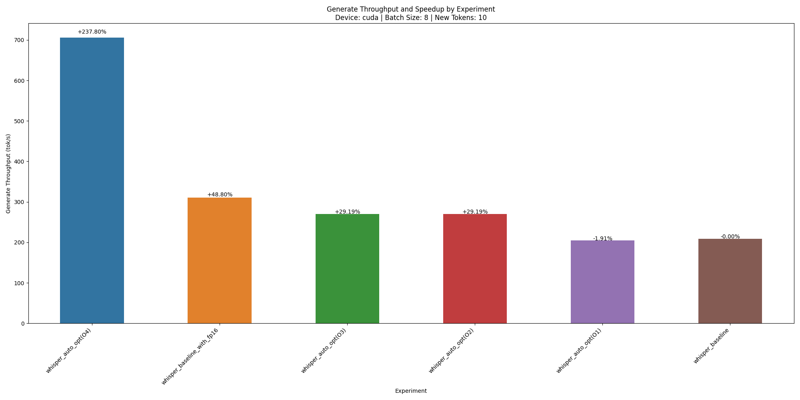
</div>
    
### Batch Size = 8, New Tokens = 100

<div>
  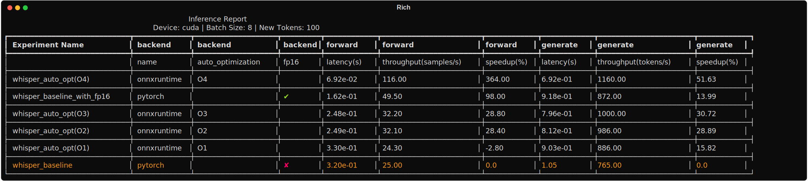
</div>

<div>
  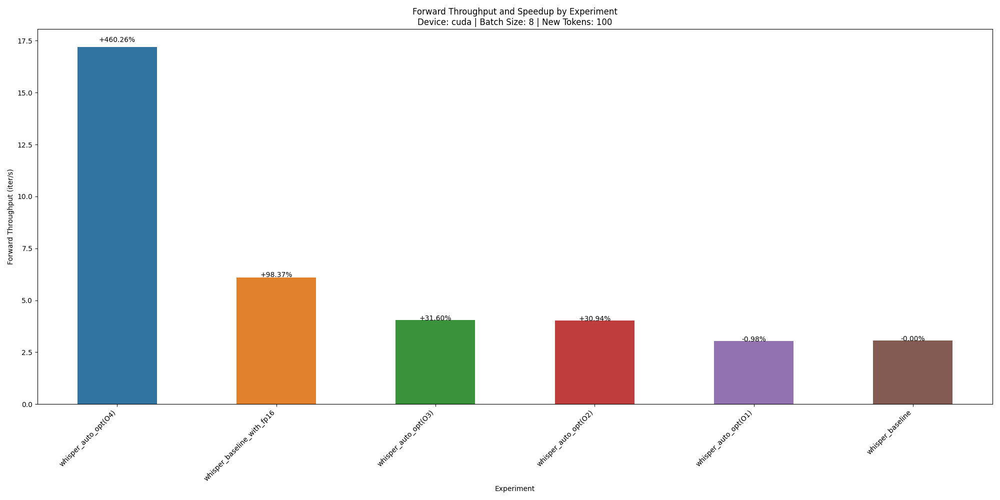
  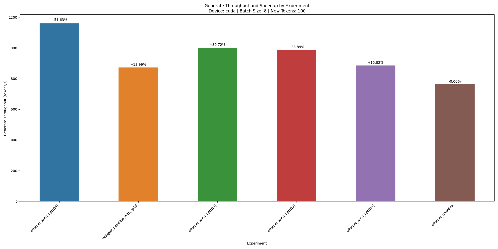
</div>

## CPU Results (Intel(R) Xeon(R) CPU @ 2.20GHz)

### Batch Size = 1, New Tokens = 10

<div>
  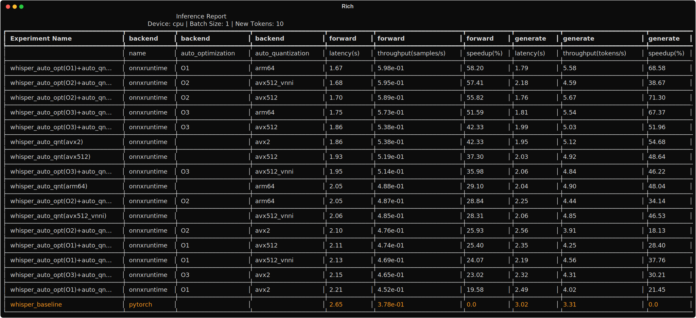
</div>

<div>
  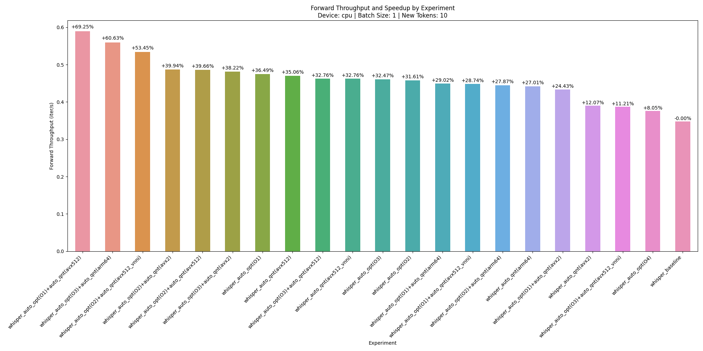
  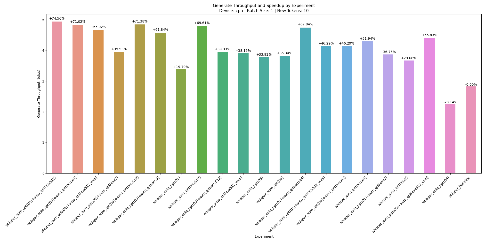
</div>

### Batch Size = 1, New Tokens = 100

<div>
  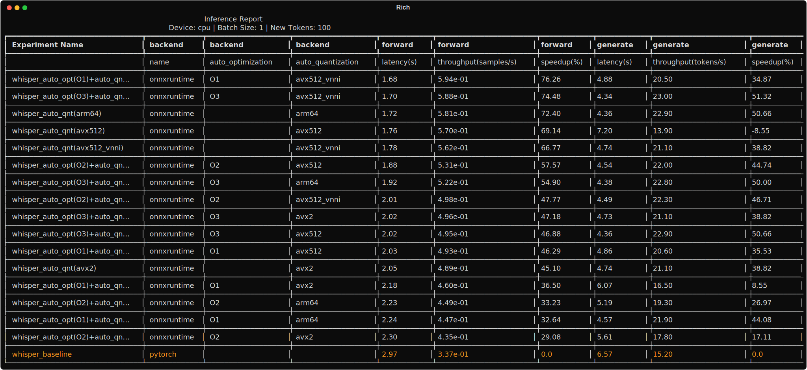
</div>

<div>
  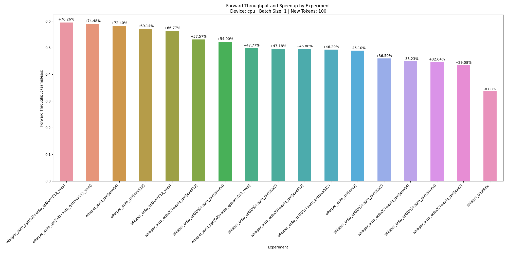
  
</div>

## Notes:

- It's interesting that Pytorch's `fp16` mixed precision is sloweer than baseline in some scenarios (low batch_size).
- Optmum's auto optimizations accelerate encoding (forward pass) greatly. A little less for decoding (generate pass).
- In previous experiments, I made the mistake of comparing generation throughput without forcing the number of generated tokens (setting `max_new_tokens` is not enough).
  As you can see, for example generation throughput (tokens per second) when `num_tokens=100` is around 500% higher than when `num_tokens=10`. This is because the encoding (compute-heavy) of the input takes most of the time in the second case.
- As you can see for GPU, generation throughput speedup is positively correlated with `batch_size` (better parallelization) and negatively correlated with `num_tokens` (generation loop bottleneck).
